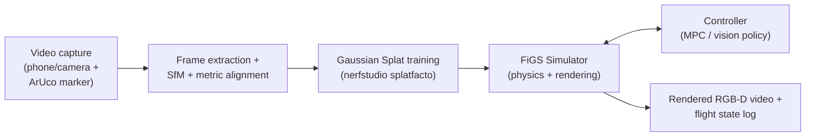
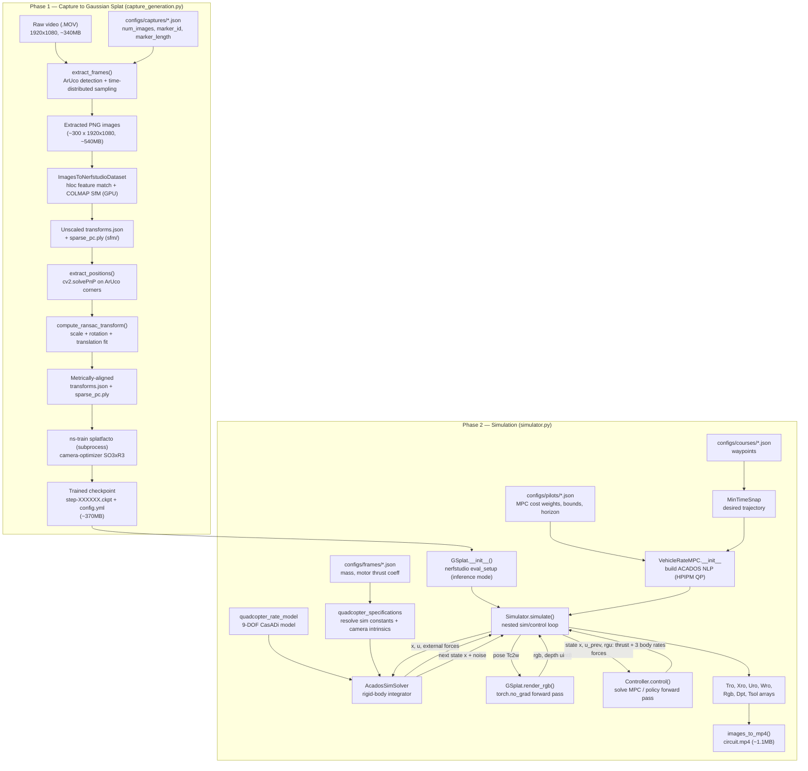

# The FiGS Pipeline

*Flying in Gaussian Splats — Stanford MSL, from "SOUS VIDE: Cooking Visual Drone Navigation Policies in a Gaussian
Splatting Vacuum" (arXiv 2412.16346). Numbers and file sizes below are measured from our own validation run on the
`backroom` example scene (see `FiGS_validation_notes.md`), not just quoted from the paper.*

## Introduction

FiGS is a drone flight simulator built around 3D Gaussian Splatting instead of a traditional game-engine renderer.
A regular drone simulator (Gazebo, AirSim, etc.) renders a hand-modeled 3D scene; FiGS instead reconstructs a
*photorealistic* 3D scene directly from a short handheld/phone video of a real room, then flies a physically
simulated drone through that reconstruction, rendering the drone's onboard camera view from inside the splat at
every simulation step. The result is a simulator whose visuals are close to indistinguishable from the real
environment, which is the property SOUS VIDE exploits to train vision-based navigation policies that transfer
zero-shot to real hardware.

FiGS is two things bolted together:

1. A **scene reconstruction pipeline** — video in, Gaussian Splat model out.
2. A **physics + rendering simulator** — given a splat and a trajectory/controller, simulate a rigid-body drone
   flying through it, rendering RGB+depth images from the drone's camera at every step.

## Prerequisites

Validated configuration (see `FiGS_validation_notes.md` for the full setup log, including the exact build errors
hit and how they were resolved):

| Requirement | Detail |
|---|---|
| GPU | NVIDIA, CUDA compute capability ≥ 7.5 recommended. Validated on RTX 3050 Ti Laptop (4GB VRAM, compute 8.6) — sufficient for *inference/simulation* on an existing splat; *training* a new splat is the VRAM-heavy step and untested at time of writing |
| OS | Ubuntu 24.04 (validated); Linux generally required (acados, colmap, hloc build tooling) |
| Python | 3.10 (pinned by `environment_x86.yml`) |
| CUDA toolkit | 11.8, installed via conda — must take priority on `PATH` over any newer system CUDA |
| Host compiler | GCC ≤ 11 (CUDA 11.8's nvcc rejects GCC 12+; Ubuntu 24.04 ships GCC 13 by default, so `gcc-11`/`g++-11` must be installed separately) |
| Core libraries | PyTorch 2.1.2, `tiny-cuda-nn` (compiled from source against the drone's specific GPU arch), `nerfstudio==1.1.4` (provides the `splatfacto` Gaussian Splatting method), `gsplat`, COLMAP 3.x (built with CUDA), Hierarchical-Localization (`hloc`), `acados` (built from source — MPC solver, CPU-only, no GPU needed) |
| Disk | A single scene like `backroom` (below) consumes ~2.4GB of intermediate + final artifacts; budget several GB per scene |
| Input hardware | A camera (phone is fine) and a single printed ArUco marker (`DICT_4X4_50`) of known physical size, placed visibly in the scene |

## What It Does

Given a ~1-3 minute video walk/fly-around of a real room with an ArUco marker placed in it, FiGS produces a
Gaussian Splat model of that room scaled to real-world metric units, anchored to the ArUco marker's coordinate
frame. It then lets you simulate a rigid-body drone (9-DOF: position, velocity, orientation as a quaternion) flying
through that splat under a chosen controller (typically a nonlinear MPC tracking a minimum-snap trajectory through
waypoints), rendering the drone's onboard camera (RGB + depth) at every control step, at up to ~130 fps according
to the paper. The output is a full flight log — time/state/control/force arrays plus the rendered image sequence —
which can be turned into an MP4 or used directly as training data for a vision-based policy (which is what SOUS
VIDE's SV-Net distillation step does downstream of FiGS).

## How It Does It

FiGS has two independent phases, run separately:

### Phase 1 — Capture → Gaussian Splat (`figs.render.capture_generation.generate_gsplat`)

1. **Frame extraction.** OpenCV reads the source video and an ArUco detector (`cv2.aruco`, dictionary
   `DICT_4X4_50`) scans every frame for the marker. Frames are split into "marker visible" and "marker not
   visible" bins. A configured number of frames are sampled from each bin (evenly distributed across time via
   `distribute_values`) and written out as individual PNGs — this subsampling is why a 5,588-frame video collapses
   to a few hundred training images.
2. **Structure-from-Motion.** The extracted images are handed to nerfstudio's `ImagesToNerfstudioDataset`
   pipeline, which uses `hloc` (Hierarchical Localization) for feature extraction/matching and COLMAP for
   triangulation, GPU-accelerated. This estimates a camera pose for every image and a sparse 3D point cloud — but
   in SfM's own arbitrary, unscaled coordinate frame.
3. **Metric alignment via ArUco.** For every frame where the marker was detected, `cv2.solvePnP` computes the
   marker's pose directly from its known physical size and the camera intrinsics — giving a small set of
   *ground-truth-scale* 3D positions. A RANSAC-fitted similarity transform (scale + rotation + translation) is then
   solved between the SfM point positions and these ArUco-derived positions, and applied to every camera pose and
   every sparse point. This is what turns SfM's arbitrary scale into real metric units anchored to a known frame —
   the step that makes the eventual splat usable for physically meaningful drone dynamics rather than an
   unscaled/unanchored 3D reconstruction.
4. **Gaussian Splat training.** With scaled poses and a point cloud written out as `transforms.json` +
   `sparse_pc.ply`, FiGS shells out to nerfstudio's `ns-train splatfacto` as a subprocess (camera-optimizer mode
   `SO3xR3`, no additional pose/scale normalization since it's already been metrically aligned). This is standard
   3D Gaussian Splatting optimization — this is also the single most VRAM-hungry step in the whole pipeline.

### Phase 2 — Simulation (`figs.simulator.Simulator`)

1. A trained splat is loaded into a `GSplat` wrapper via nerfstudio's `eval_setup(...,test_mode="inference")`,
   which restores the trained pipeline/model from its checkpoint onto the GPU.
2. A 9-DOF quadcopter dynamics model (position, velocity, quaternion — `figs.dynamics.quadcopter_rate_model`) is
   compiled into an ACADOS integrator (`AcadosSimSolver`) for fast numerical simulation. Control inputs are
   collective thrust + 3 body rates.
3. A controller (e.g. `VehicleRateMPC`) is separately built from a **course** config (waypoints + timing, resolved
   into a minimum-snap desired trajectory via `MinTimeSnap`) and a **frame** config (drone mass, motor thrust
   coefficient). It's a nonlinear MPC solved with ACADOS/HPIPM over a receding horizon, tracking the desired
   trajectory.
4. `Simulator.simulate()` runs a nested loop: an inner physics loop at simulation rate (state integration via
   ACADOS, with optional model + sensor noise), and an outer control loop at the controller's rate. At every
   control step, the drone's current pose is used to render an RGB+depth image from the Gaussian Splat (this is
   the actual "flying in a Gaussian Splat" moment — the camera pose feeds `GSplat.render_rgb`, which does a
   `torch.no_grad()` forward pass through the trained splat model), and that image is handed to the controller
   (in `VehicleRateMPC`'s case it's unused — MPC here uses privileged state, not vision — but this is the hook SOUS
   VIDE's vision-based `SV-Net` policy uses instead).
5. Everything is logged into arrays and returned; `figs.visualize.generate_videos.images_to_mp4` turns the
   rendered RGB stream into an MP4.

## Input → Output Flow

Concrete sizes/types below are from our own run (the `backroom` scene: a 300-image ArUco-tagged capture, `circuit`
course, `Viper` pilot, `carl` frame).

| Stage | Input | Output |
|---|---|---|
| 1. Raw capture | Video file (`.MOV`/`.mp4`), any resolution/length containing a visible ArUco marker (`DICT_4X4_50`) of known size. Measured: `backroom.MOV`, H.264, 1920×1080, 29.97fps, 186s, 5,588 frames, **339MB** | — |
| 2. Frame extraction | Video + `configs/captures/*.json` (extractor settings: `num_images`, `num_marked`, `marker_length`, `marker_id`) — our config: 300 images total, 20 must be marker-tagged, marker 34.1cm, ID 0 | Folder of PNGs, one per sampled frame. Measured: **300 images**, 1920×1080 RGB, **539MB total** (~1.8MB/image) |
| 3. Structure-from-Motion (hloc + COLMAP) | The 300 PNGs | `sfm/` working directory (features, matches, COLMAP database/reconstruction) — measured **1.5GB**; plus a raw `transforms.json` (camera poses + intrinsics) and `sparse_pc.ply` (point cloud) inside it |
| 4. ArUco metric alignment | SfM's `transforms.json`/`sparse_pc.ply` + detected marker corners across the tagged frames | Rescaled/re-anchored `transforms.json` (**260KB**, JSON: per-frame 4×4 camera-to-world matrices + camera intrinsics) and `sparse_pc.ply` (**1.4MB**, binary point cloud) written to the scene's workspace root |
| 5. Splat training (`ns-train splatfacto`) | The scaled `transforms.json` + `sparse_pc.ply` + source images | A nerfstudio output directory: `config.yml`, `dataparser_transforms.json`, and a `nerfstudio_models/step-XXXXXX.ckpt` checkpoint (PyTorch state dict of Gaussian parameters: positions, scales, rotations, opacities, spherical-harmonic color coefficients). Measured: **371MB** checkpoint at step 29,999 |
| 6. Splat loading (inference) | The `.ckpt` + `config.yml` | An in-memory `GSplat` object wrapping a loaded nerfstudio pipeline on GPU — no file output, this is the runtime object used for rendering |
| 7. Simulation rollout | `GSplat` object + course config (waypoints) + frame config (drone mass/geometry) + pilot config (MPC costs/bounds) | In-memory NumPy arrays: time (`Tro`), state (`Xro`, N×10), control (`Uro`, N×4), forces (`Wro`, N×6), RGB frames (`Rgb`, N×H×W×3 `uint8`), depth frames (`Dpt`, N×H×W×3 `uint8`), solve-time diagnostics |
| 8. Video export | The `Rgb` array + control rate (Hz) | MP4 video of the onboard camera view. Measured: `circuit.mp4`, H.264, 640×360, 20fps, 247 frames (~12.3s), **1.1MB** |

## Simplified Architecture



```
 ┌────────────────┐     ┌──────────────┐     ┌───────────────┐     ┌────────────────┐
 │  Video capture  │ ──▶ │   Frame +    │ ──▶ │  Gaussian     │ ──▶ │   FiGS          │
 │ (phone/camera + │     │   SfM +      │     │  Splat        │     │   Simulator      │
 │  ArUco marker)  │     │   metric     │     │  training     │     │  (physics +      │
 │                 │     │   alignment  │     │  (nerfstudio) │     │   rendering)     │
 └────────────────┘     └──────────────┘     └───────────────┘     └────────────────┘
                                                                            │
                                                        ┌───────────────────┴───────────────────┐
                                                        ▼                                        ▼
                                              Controller (MPC / policy)              Rendered RGB-D video +
                                              drives simulated drone                  flight state log
```

## Detailed Architecture

```
FiGS-Examples / SousVide (repo root)
├── configs/                          Declarative configuration — no code changes needed to try variants
│   ├── captures/*.json               Per-camera-device ArUco/extractor settings (default, pixel8pro, iphone15pro)
│   ├── frames/*.json                 Drone physical specs (mass, motor thrust coeff) — e.g. "carl"
│   ├── courses/*.json                Waypoint trajectories to fly — e.g. "circuit", "traverse", "infinity"
│   ├── pilots/*.json                 MPC tuning: cost weights (Qk/Rk/QN), horizon, input bounds — e.g. "Viper"
│   ├── methods/*.json                Rollout configs: control/sim frequency, noise models (data_* for training-
│   │                                 data collection variants, eval_* for evaluation-condition variants)
│   └── nnio/*.json                   Neural-net I/O configs (used by SOUS VIDE's SV-Net policy, not core FiGS)
│
├── gsplats/
│   ├── capture/*.MOV                 Raw input videos (one per scene)
│   └── workspace/<scene>/
│       ├── images/                   Extracted PNG frames
│       ├── sfm/                      hloc + COLMAP working directory
│       ├── transforms.json           Final metrically-aligned camera poses + intrinsics
│       ├── sparse_pc.ply             Final metrically-aligned sparse point cloud
│       └── outputs/<scene>/splatfacto/<timestamp>/
│           ├── config.yml            nerfstudio training config (frozen at train time)
│           ├── dataparser_transforms.json
│           └── nerfstudio_models/step-XXXXXX.ckpt   Trained Gaussian Splat weights
│
└── FiGS/src/figs/                    Core package
    ├── render/
    │   ├── capture_generation.py     Phase 1 driver: extract_frames() → hloc/COLMAP SfM → extract_positions()
    │   │                             (ArUco PnP) → compute_ransac_transform() → ns-train subprocess
    │   └── gsplat.py                 GSplat class: loads a trained checkpoint (nerfstudio eval_setup), exposes
    │                                 generate_output_camera() and render_rgb() (pose in → RGB+depth out)
    │
    ├── simulator.py                  Simulator class: owns the GSplat + an ACADOS AcadosSimSolver (drone physics
    │                                 integrator) + external-forces model; simulate() runs the nested sim/control
    │                                 loop described above
    │
    ├── dynamics/
    │   ├── quadcopter_rate_model.py  9-DOF state (p, v, quaternion), 4D control (thrust + 3 body rates) — CasADi
    │   │                             symbolic model compiled into ACADOS
    │   ├── quadcopter_specifications.py  Resolves a "frame" config into simulation constants (mass, rotor count,
    │   │                             thrust coeff, camera intrinsics, image dimensions, camera-to-body transform)
    │   └── external_forces.py        Optional disturbance-force model (wind gusts etc., used in robustness tests)
    │
    ├── control/
    │   ├── base_controller.py        Common controller interface: .control(t,x,u_prev,rgb,dpt,f) → (u, solve_times)
    │   └── vehicle_rate_mpc.py       VehicleRateMPC: builds an ACADOS nonlinear MPC (NONLINEAR_LS cost, HPIPM QP
    │                                 solver) around a MinTimeSnap-generated desired trajectory through the course
    │                                 waypoints; privileged-state controller (ignores rgb/dpt — this is the "expert"
    │                                 used to generate training data in the SOUS VIDE paper, as opposed to the
    │                                 vision-only SV-Net policy that consumes rgb/dpt at deployment)
    │
    ├── tsplines/min_time_snap.py     Converts waypoints into a smooth, dynamically-feasible minimum-snap
    │                                 trajectory (desired position/velocity/orientation over time)
    │
    ├── utilities/                    Config loading/resolution, coordinate transform helpers, quaternion/
    │                                 orientation helpers, capture-processing helpers (RANSAC transform,
    │                                 even-distribution sampling)
    │
    └── visualize/generate_videos.py  images_to_mp4(): turns a rendered RGB frame array into an MP4
```

### Detailed architecture — Mermaid



### Data/control flow inside a single simulation step

```
Simulator.simulate() loop (per control step):
  current state x ──▶ pose (Tc2w) ──▶ GSplat.render_rgb(camera, Tc2w) ──▶ rgb, depth
                                                                              │
  x, u_prev, rgb, depth, sensed force/torque ──────────────────────────────▶│
                                                                              ▼
                                                              Controller.control(...) ──▶ u (thrust + body rates)
                                                                              │
                                            u, external forces ──▶ AcadosSimSolver.simulate() ──▶ next state x
```

For `VehicleRateMPC` specifically, `rgb`/`depth` are accepted by the interface but unused — control comes from
solving the MPC against privileged state. A vision-based policy (SV-Net, in the SousVide repo) implements the same
`BaseController` interface but uses `rgb`/`depth` as its actual input, which is the point of building FiGS as a
photorealistic simulator in the first place: the same code path can drive either a privileged expert or a
vision-only policy through an environment that looks like the real one.
