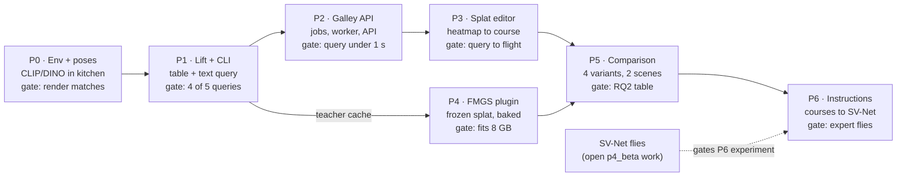

# Semantic Splat Embeddings — Phase-wise Implementation Plan

As of 5 Oct 2026 · Suhan. Live version (editable, with tick-boxes):
https://claude.ai/code/artifact/d12ee1d2-3737-424f-bca9-6827f3e195aa — design reference:
[Semantic Feature Embeddings for the Gaussian Splat — Integration Plan](https://claude.ai/code/artifact/583626c1-bc4f-4394-aaeb-bd9aca54454e).
This file is a snapshot; status of each phase is recorded in `docs/SEMANTICS.md`.

## Roadmap at a glance

Seven phases, each closed by a gate run on intellisense08. The training-free lift track (P0–P3) reaches a working
query → course → flight first. FMGS (P4) joins for the comparison (P5), and P6 turns instructions into courses for
SV-Net. There are no calendar dates yet, so the order shows dependency, not duration.

P3 is the first demo: a typed phrase flies the expert to the object. Only P6's policy experiment waits on SV-Net
flying, which is outside this plan.

## Phase 0 — Environment and pose check

This phase proves three things before any feature work: CLIP and DINOv2 can live in `kitchen` without touching
torch 2.1.2, the installed gsplat renders N-channel features with gradients, and the checkpoint's optimized cameras
reproduce the training images. Test scene: backroom on intellisense08.

### Tasks

**Package skeleton**

- [ ] `semantics/pyproject.toml` — package `radiance-semantics`, Python 3.10, dependencies listed for documentation but installed with `--no-deps`.
- [ ] `semantics/radiance_semantics/__init__.py`, `paths.py` (scene workspace, `semantics/<run>/<backend>/` layout, state dir), `log.py` (reuses the `info/ok/warn` style from `figs_pipeline.py`).

**Install, without moving torch**

- [ ] New step `semantics` in `setup_scripts/install_figs.sh` (it is already step-addressable): `pip install --no-deps` OpenCLIP plus its pure-Python dependencies (`ftfy`, `regex`, `huggingface_hub`), then `pip install -e semantics --no-deps`.
- [ ] Choose the newest OpenCLIP release that imports on torch 2.1.2, and record the pin in the script.
- [ ] Pre-download weights into the caches `install_figs.sh` already sets: OpenCLIP `ViT-B-16` / `laion2b_s34b_b88k`, and DINOv2 `dinov2_vits14` through `torch.hub`. A host without internet then still works.
- [ ] Re-run the existing torch-pin check after the step. It must fail loudly if torch, tiny-cuda-nn or gsplat changed.

**Checks**

- [ ] `setup_scripts/verify_figs.sh --semantics` — imports, one CLIP image and text forward pass, one DINOv2 forward pass, torch still `2.1.2`.
- [ ] `semantics/radiance_semantics/probe.py` — build random Gaussians at backroom's size, render 64 feature channels with the gsplat call splatfacto uses, and backpropagate. Compare `f.grad` against a finite difference on a few Gaussians. Log ms and peak MiB at 480×270 and 960×540.
- [ ] `semantics/radiance_semantics/cameras.py` — load the run with nerfstudio `eval_setup`, list the training cameras and image paths, and apply the trained camera optimizer to each camera (look up the exact 1.1.4 call, e.g. `CameraOptimizer.apply_to_camera`).
- [ ] `cameras` check — render 10 training views with optimized poses and with raw `transforms.json` poses. Report PSNR for both against the images.

### Tests

- Cloud (no GPU): `semantics/tests/test_paths.py` and an import smoke test with gsplat and CUDA mocked.
- Host: `ui/deploy/sem0_gate.sh`, in the same style as the phase 1–4 gates.

### Gate

- `verify_figs.sh --quick` and `--semantics` both pass on intellisense08, and torch is still 2.1.2.
- The probe's gradient matches the finite difference, and its VRAM and time are written to `runs/`.
- Optimized-pose PSNR is at least raw-pose PSNR and close to splatfacto's own evaluation PSNR. If it isn't, Phase 1 does not start.

## Phase 1 — Teacher features, lift backend, CLI query

At the end of this phase, one command turns backroom's trained splat into a per-Gaussian CLIP + DINO table, and a
second command turns a phrase into ranked 3D candidates with an approach point. There is no UI yet.

### Tasks

**Step runner: `figs/semantic_pipeline.py`** (modelled on `svnet_pipeline.py`)

- [ ] Import the shared helpers from `figs_pipeline.py` (`StepFailed`, `VramMonitor`, `info/ok/warn`, `resolve_project_root`).
- [ ] Copy svnet's marker pattern: each step's fingerprint includes the previous step's marker, and every GPU step runs as a child process (`--in-step`).
- [ ] Settings saved per scene and run in `<PROJECT_ROOT>/.semantic_pipeline_state/<scene>/<run>/config.json`, so a resume needs only `--scene`.
- [ ] Flags: `--scene`, `--backend lift|fmgs|both`, `--teachers clip,dino`, `--clip-model`, `--dino-model`, `--feat-res`, `--from`, `--only`, `--redo`, `--status`.
- [ ] Steps in this phase: `preflight`, `cameras`, `teachers`, `lift`, `export`. Plain progress lines, and a final JSON result in `runs/` (time and peak VRAM per step).

**Teacher features: `radiance_semantics/teachers.py`**

- [ ] CLIP pyramid: port LERF's multi-scale patch embedding. At 7 crop scales from 0.05 to 0.5 of the image, slide crops, embed each with OpenCLIP, place on a common grid, and average the scales as FMGS does.
- [ ] DINOv2: resize to a multiple of 14, keep the dense patch tokens.
- [ ] Output in `gsplats/workspace/<scene>/semantics/teachers/<tag>/`: fp16 `.npy` per image plus `meta.json` (model ids, grid sizes, image-list hash). `<tag>` hashes models and settings, so changing a model never mixes files.
- [ ] Batch crops for GPU efficiency. Measure time per image and total size; the design estimate is 1–2 GB per 300 images.

**Lift backend: `radiance_semantics/lift.py`**

- [ ] For each training camera with optimized pose: render per-Gaussian features `f = 0` that require grad at `--feat-res`, take `loss = (render(f) · F2D).sum()`, backpropagate, and add `f.grad` into a host-RAM accumulator. One pass with `f = 1` gives the weight sums.
- [ ] Work in 64-channel chunks so 512 + 384 channels fit in 8 GB.
- [ ] Divide by the weights, then L2-normalise CLIP vectors. Gaussians with zero weight (never seen) get a zero vector and a mask bit.
- [ ] Optional flag for later: `--diffuse` (LUDVIG-style DINO graph diffusion). Leave it off in v1.

**Shared ordering and export**

- [ ] Refactor `figs/course_tools.py splat` so the selection (opacity ≥ 0.05, most visible first, at most 1 M) is one function, `splat_order(state, min_opacity, max_splats)`. `cmd_splat` and the semantic export both call it, so feature row i always belongs to `.splat` record i.
- [ ] `radiance_semantics/store.py` writes `clip.f16` and `dino.f16` (memory-mapped), `pca_rgb.u8` (3 PCA components of CLIP, 1st–99th percentile to 0–255) and `index.json` (run, checkpoint name and mtime, backend, teacher tag, N, hash of the order, step metrics).

**Query: `radiance_semantics/query.py` + CLI `figs/semantic_query.py`**

- [ ] CLIP text encoding with LERF's canonical negatives, then per-Gaussian relevancy (formula in the integration plan).
- [ ] Selection weighted by opacity × volume, then 3D clustering by voxel connected components (0.1 m voxels, `scipy.ndimage.label`). This is deterministic and needs no new dependency.
- [ ] Rank candidates by summed weighted relevancy. Each returns its centroid, box, score and margin over the runner-up.
- [ ] Approach point: the standoff (default **1.0 m**, a flag) points from the centroid toward the mean position of the training cameras that saw the cluster, kept horizontal, clipped to the course waypoint box from `course_tools.py geometry`.
- [ ] Gap check: reuse `course_tools.py`'s clearance (k-th nearest sparse point minus body radius 0.19 m, minimum gap 0.15 m).
- [ ] Usage: `semantic_query.py --scene backroom --backend lift "office chair"` prints JSON.

### Tests

- Cloud (no GPU): relevancy against a hand-computed reference; clustering on synthetic blobs (two instances must split); `splat_order` gives identical results to today's `cmd_splat` on a synthetic checkpoint; store round-trip; approach-point clipping.
- Host: `ui/deploy/sem1_gate.sh` runs the backroom pipeline, then 5 queries.

### Gate

- The pipeline finishes on intellisense08 within 8 GB; time, peak VRAM and artefact size are recorded.
- Five backroom objects, chosen after looking at the splat, each have a hand-placed position. Use the course editor's existing semantic-goal marker to read off positions.
- At least 4 of 5 queries put the top candidate on the right object. Fewer is a finding to fix in this phase, not a reason to move on to FMGS.

## Phase 2 — Galley backend

Galley can queue the semantic pipeline, report its state per scene, and answer text queries in under a second
through a CPU worker. Everything is tested with fake scripts in the cloud, the way videos and Drive were.

### Tasks

**Jobs: `ui/backend/galley/semantics.py`**

- [ ] `SemanticRun` (Pydantic): scene, backends, teachers, models, `feat_res`, `from_step`, `only`, `redo`. `build_argv()` mirrors `svnet.build_argv`.
- [ ] `POST /api/jobs/semantics` in `app.py`, next to `/api/jobs/figs` and `/api/jobs/svnet`. The job carries the scene, so Archive/Promote wait for it as they do for SV-Net cohorts.
- [ ] `GET /api/scenes/{scene}/semantics` reads the state dir and each backend's `index.json`. It marks a backend **stale** when the run, checkpoint name or mtime differs from the active model, with the same key Galley's `.splat` cache uses.
- [ ] Settings: `semantic_script` and `semantic_query_script` beside `pipeline` (default: next to `figs_pipeline.py`), plus a worker idle timeout. Machine profiles (`ui/machines/*.toml`) can set `feat_res` defaults: intellisense08 960×540, dummy 480×270.

**Query worker: `figs/semantic_worker.py` (kitchen) + `ui/backend/galley/semworker.py`**

- [ ] The worker reads JSON lines on stdin and writes one JSON line per request on stdout: `load {scene, run, backend}`, `query {text, negatives, threshold, standoff}`, `relevancy {id}`, `ping`. It keeps OpenCLIP's text tower and the memory-mapped tables loaded.
- [ ] Galley starts it like `CourseTools._run` (`bash -c 'source figs_env.sh; exec …'`, `CUDA_VISIBLE_DEVICES=""`), but as a long-lived `Popen`. One request at a time behind a lock; restart on crash; stop after the idle timeout; reload when `index.json` changes.
- [ ] Relevancy results are cached in Galley's memory by id (last 8), as N bytes in `.splat` order, served gzipped.

**Endpoints**

- [ ] `POST /api/scenes/{scene}/semantics/query` → candidates (centroid, box, score, margin, approach, gap, gap_ok) + `relevancy_id` + timing.
- [ ] `GET /api/scenes/{scene}/semantics/relevancy/{id}` and `GET /api/scenes/{scene}/semantics/{backend}/pca` (bytes).
- [ ] `GET/PUT /api/scenes/{scene}/semantics/queries` — ground-truth annotations stored in `gsplats/workspace/<scene>/semantics/queries.json` (label, position, optional box, author, date).
- [ ] No new course endpoint. `semantic_goal` keeps going through the existing course save (`PUT /api/configs/courses/{name}`); the course model in `configs.py` accepts the new optional fields `query`, `backend`, `score`, `extent`, `approach`.

### Tests

- `tests/test_semantics.py`: argv building, status and stale detection from fixture state dirs, job submission, Archive/Promote refusal while a semantic job runs.
- `tests/test_semworker.py`: a fake worker script (stdlib only) checks start, request and reply, crash restart, idle stop, reload on `index.json` change, and the 400/409/503 error paths.
- `tests/test_configs.py`: a course with the extended `semantic_goal` validates and round-trips byte-for-byte.

### Gate

- All backend tests pass (83 today, plus the new ones).
- On intellisense08 through the port forward: submit a lift job for backroom from `curl`, then `POST …/query` returns candidates in under 1 s once the worker is warm. Record the cold start time.

## Phase 3 — Splat editor UI

The aim is to type a phrase, see the matching Gaussians light up, pick a candidate, and send it into a course that
then flies through the existing *Save and fly*. The UI reuses the `.splat` endpoint, drei's `<Splat>`, the
splat → course frame flip and the keyboard flying from the course 3D view.

### Tasks

**Document and navigation: `ui/frontend/src/main.tsx`, `shell/`**

- [ ] Route `#/splat/<scene>` → document key `splat:<scene>`, icon `splat`, lazy-loaded like the course editor.
- [ ] A `TAB_FOR` entry for a contextual **Semantics** ribbon tab, plus Explorer entries (scene ▸ Semantics ▸ lift / fmgs).
- [ ] `shell/ribbonSpec.ts`: the Build, Query, View, Goal and Annotate groups from the integration plan, each command with hover help naming the script and flags it runs, as the other tabs do.

**Page: `ui/frontend/src/pages/SplatEditor.tsx` + `src/splat/`**

- [ ] `splat/SplatView.tsx`: factor the splat part of `course/Scene3D.tsx` out so both documents share it (load state, error boundary, demand-frame workaround, keyboard flying).
- [ ] `splat/recolor.ts`: fetch the `.splat` once into an `ArrayBuffer`. For Relevancy or PCA mode, copy it, overwrite RGBA (bytes 24–27 of each 32-byte record) with a colour map of the relevancy byte or the PCA RGB, and pass a `blob:` URL to `<Splat src>`. If drei's loader rejects blob URLs or reloads too slowly at 1 M splats, vendor its loader as a local component that takes a buffer.
- [ ] Colour map: a sequential map for relevancy, an opacity floor slider, and *Candidates only*, which greys everything outside the selected cluster.
- [ ] `splat/pick.ts`: click ray → nearest Gaussian centre along the ray weighted by opacity, from positions parsed from the same buffer (CPU, with a spatial grid built once). The Properties pane shows the position and that Gaussian's best matches against an editable label list, via a `labels` request to the worker.
- [ ] Candidates pane: rows of score, margin (flagged when ambiguous), size and gap. Hover draws the box; select shows the goal marker, approach point and the drone's 0.19 m sphere.
- [ ] Query bar: text, backend toggle, threshold, standoff (default 1.0 m), advanced negatives. *Compare* splits the view into lift | FMGS with linked cameras, enabled once both exist.
- [ ] Build group: the job dialog (backends, teachers, Continue, Redo step), a status pill per backend (none, running, ready, stale), live log through the existing job views.
- [ ] Annotate mode: type a label, click to place, saved through `PUT …/semantics/queries`; existing annotations are drawn as labelled pins.

**Course hand-off: `course/model.ts`, `pages/Course.tsx`**

- [ ] Extend `SemanticGoal` with optional `query`, `backend`, `score`, `extent`, `approach`, and keep them when the marker is moved. Moving it clears `score`, because the position is no longer the resolved one.
- [ ] *Send to course…*: choose a course or create one, write `semantic_goal`, optionally append the approach point as the final keyframe (yaw facing the object), save, and open the course editor.
- [ ] Course editor: the Semantic goal tile shows query, backend and score read-only, with *Open in splat editor*.

**Scene page**

- [ ] A Semantics tile per active run: backend status, time, peak VRAM, artefact size, and eval metrics once Phase 5 exists.

### Tests

- TypeScript build and lint clean; unit tests for `recolor.ts` (byte offsets, colour map, cap) and `pick.ts` (synthetic Gaussians).
- Headless Chromium in the cloud against the fake worker: open `#/splat/backroom`, query, heatmap, select, *Send to course*, and check the saved course JSON.
- Rebuild `dist/` and commit it, as Galley does today.

### Gate

- On intellisense08 through the browser: query backroom → pick → *Send to course* → *Save and fly*. The flight passes `course`, `simulate` and `validate`, and the drone ends at the approach point.
- Recolouring 1 M splats takes under about 2 s. If not, take the vendored-loader route.

## Phase 4 — FMGS backend (`splatfacto-sem`)

This phase trains the FMGS hash-grid field against backroom's frozen Gaussians through a nerfstudio plugin, then
bakes it into the same table the lift backend writes. After that, the query worker, UI and evaluation use it with no
further changes. nerfstudio and SousVide are not edited.

### Tasks

**Plugin registration: `radiance_semantics/fmgs/config.py`**

- [ ] A `MethodSpecification` named `splatfacto-sem`, registered in `semantics/pyproject.toml` under `[project.entry-points."nerfstudio.method_configs"]`. It should appear in `ns-train --help` after `pip install -e`.
- [ ] Trainer: 4,200 iterations, TensorBoard logging (Galley's `tfevents.py` already reads it), a checkpoint every 1,000 steps.
- [ ] The dataparser arguments are copied from the `train` command in `figs_pipeline.py` (orientation and centre `none`, no auto-scale), so frames match the splat exactly.

**Model: `fmgs/model.py` — `SemanticSplatfactoModel(SplatfactoModel)`**

- [ ] Config field `splat_ckpt`: in `populate_modules`, copy `gauss_params.*` and the trained camera-optimizer parameters from the checkpoint, then set `requires_grad=False` on all of them.
- [ ] Override `get_training_callbacks` to drop densify, prune and opacity reset. Override `get_param_groups` to return only `feature_field`.
- [ ] Pick the trainable subset once: about 40% of Gaussians by opacity, then per view by projected radius from the rasterizer's output, as FMGS does.
- [ ] `FeatureField` (`fmgs/field.py`): tiny-cuda-nn hash grid (24 levels, resolution 16→512, table 2^20, 8 features per level) on centres normalised by the scene's 1st–99th percentile box, then two tiny-cuda-nn MLP heads: CLIP 512 and DINO 384.
- [ ] `get_outputs`: evaluate the field only for visible selected Gaussians, rasterize the features with gsplat at `--feat-res` in channel chunks, and return the `clip` and `dino` maps next to the (frozen) RGB.
- [ ] Losses (`fmgs/losses.py`): 0.2 · CLIP Huber (δ 1.25) against the pyramid grid, 0.8 · DINO L2, and 0.01 · pixel alignment (dot-product consistency between a pixel and its neighbours across the CLIP and DINO spaces).
- [ ] Learning rates: start from LERF's hash-grid settings and record what was used.

**Data: `fmgs/datamanager.py` — `SemanticDataManager`**

- [ ] Subclass the full-image data manager splatfacto uses, and add each image's teacher grids from the Phase 1 cache (held on CPU, moved per batch).

**Pipeline steps in `semantic_pipeline.py`**

- [ ] `fmgs`: `ns-train splatfacto-sem --pipeline.model.splat-ckpt <ckpt> --output-dir semantics/<run>/fmgs/train …`, in a child process with the VRAM monitor.
- [ ] `bake`: load the field, evaluate it at every Gaussian in `splat_order` in batches, write `clip.f16`, `dino.f16`, `pca_rgb.u8`, `index.json` and `field.pt` (the field also answers arbitrary xyz, for Stage 3 voxels).

**If 8 GB is not enough** (try in this order, and log which one was needed)

1. Feature resolution 480×270 instead of 960×540.
2. Hash table 2^19.
3. Fewer Gaussians per step: sample a random half of the visible subset.
4. B-lite: render the 192-d hash encoding (or a 64-d bottleneck), then apply the heads per pixel. This departs from FMGS and must be labelled as a variant in the results.
5. Run on the RTX 5060 Ti once the cu128 profile exists.

### Tests

- Cloud (CPU): losses against hand-computed values, coordinate normalisation, callback and parameter-group filtering on a mocked model, entry point import.
- Host: `ui/deploy/sem4_gate.sh` — a 200-step smoke run (loss falls, Gaussians unchanged by checksum), then the full run, then `bake`.

### Gate

- Full training finishes on intellisense08 with peak VRAM under 8 GB, using the defaults or a logged fallback.
- The checksum of `gauss_params` is identical before and after training, which proves the splat was not modified.
- The FMGS table loads in the splat editor, and the Phase 1 queries run on it.

## Phase 5 — Evaluation and comparison

This phase produces the results table for research question 2: which backend and backbone combination localises
goals best in room-scale scenes, and at what memory and time cost. It is measured on two scenes with an annotated
query set that stays fixed.

### Tasks

**Second scene**

- [ ] Capture and train GTN_lab_v1 through New capture (marker id 0, measured side), stop after bounds, then write one course for it. This is the existing Galley flow; nothing new is built.

**Query sets**

- [ ] Annotate at least 15 queries per scene in the splat editor's Annotate mode. Cover large and small objects, multiple instances of one class, synonyms of the same object, and 2–3 negative queries (objects not in the scene). Freeze each set by committing `queries.json`.

**Variants**

| Variant | Backend | Language | DINO used for |
| --- | --- | --- | --- |
| L-C | Lift | CLIP | — |
| L-CD | Lift | CLIP | Clustering split + diffusion |
| F-C | FMGS | CLIP | — (DINO loss weight 0) |
| F-CD | FMGS | CLIP | Regularisation (paper weights) |

**Eval step: `eval` in `semantic_pipeline.py` + `radiance_semantics/evaluate.py`**

- [ ] Run every query through `query.py` with fixed settings, and write `semantics/<run>/eval/<variant>.json` per query: top candidate, error, hit, margin, approach gap.
- [ ] Aggregate per variant: grounding error (median and 90th percentile, m), top-1 hit rate, ambiguity rate, negative-query false-positive rate, feasible approach rate, build time, peak VRAM, artefact size, query latency.
- [ ] Sweeps on the best variant: relevancy threshold, `feat_res`, cluster voxel size.
- [ ] `semantic_pipeline.py --report` writes a CSV and a LaTeX table, ready for `fyp_report.tex`.

**Galley**

- [ ] Scene page Semantics tile: a metrics table per variant with links into the splat editor at each failed query.

### Tests

- Cloud: aggregation against hand-made per-query files; the LaTeX and CSV writers.

### Gate

- All four variants run on both scenes, and their numbers fill the table.
- A short written finding per research question 2 sub-part (accuracy, memory, time) goes into the report draft. Failure cases are sorted into wrong object, right object but bad position, and no candidate.

## Phase 6 — Language to waypoints to SV-Net

An instruction becomes a feasible course, and courses built that way train an SV-Net cohort that is compared against
manually specified courses for the same objects (research questions 1 and 4). Its gate depends on the SV-Net student
flying at all, which is the open p4_beta work, so start only the parts that don't need it.

### Tasks

**Instruction to goals: `radiance_semantics/instruction.py`**

- [ ] v1 parser: split on "then", "and then" and commas into ordered object phrases. Each phrase goes to `query.py`, and the top candidate is used unless its margin is ambiguous, in which case the UI asks. Leave room for an LLM parser later (novelty direction 3).

**Goals to course: `course_tools.py semantic-course`**

- [ ] Input: scene, start pose (the course's first keyframe or the camera box's default), ordered approach points with yaw facing each object. Output: a course in the upstream layout, with `semantic_goal` set to the last goal and the full list kept under a new `semantic_goals` key (ignored by FiGS).
- [ ] Feasibility loop: run `preview` (re-time like the expert), and if a gap fails, try alternative standoff directions around the object at the same distance. Give up with a reason after a fixed number of tries.
- [ ] Batch mode: `semantic_instructions.json` (id, scene, instruction) → courses `sem_<id>`, with a report of the ones that failed and why.

**Galley**

- [ ] Splat editor: an *Instruction* box (multi-goal) → candidates per phrase → *Build course*, which opens the course editor with the preview already run.
- [ ] SV-Net page: no change needed; `sem_*` courses appear in the course list for a new cohort.

**Experiment** (once a manual-course cohort flies)

- [ ] Pick N objectives per scene. Write manual courses by hand for each (cohort A) and generate language courses for the same objectives (cohort B), with identical cohort settings.
- [ ] Compare TTE, PP and collision rate. Collision = the flown trajectory's gap to the scene falling below zero, using the same clearance as the editor.
- [ ] Instruction success rate: the share of instructions whose student flight ends within the approach tolerance of the right object.

### Tests

- Cloud: parser cases; `semantic-course` on synthetic geometry (blocked standoff → alternative direction; impossible → clear error); batch report.

### Gate

- Every instruction in the batch produces a course that passes `course`, `simulate` and `validate` with the expert, or a stated reason why not. This part does not depend on SV-Net.
- Then, once SV-Net flies, cohort A and cohort B results go into the report for research questions 1 and 4.

## Working method

This follows the same loop Galley was built with: Cowork writes and tests in its cloud copy, applies files to your
laptop checkout after checksum checks, and you commit, pull on the host and run the gate. GPU work only ever runs on
the hosts.

1. **Build (Cowork, cloud).** Work on a copy of the laptop checkout or a GitHub clone at the same commit. Write the code and the cloud tests (CPU, mocked CUDA, fake worker), and run backend tests, TypeScript build and headless-Chromium checks.
2. **Apply (Cowork → laptop).** Write the changed files into `D:\Projects\FYP\FYP-Radiance` and list them with checksums. Never run git in the laptop repo from Cowork.
3. **Commit (you).** Commit and push to `Radiance-ICE-22/Radiance-Environment-Setup`.
4. **Run (you, host).** `git pull` on intellisense08, `./run_ui.sh restart` when the UI changed, then the phase gate under tmux, e.g. `tmux new -d -s sem1 'bash ui/deploy/sem1_gate.sh > ~/sem1_gate.log 2>&1'`.
5. **Report back.** Share the gate log and the `runs/` JSON. Cowork reads them, fixes, and the loop repeats. A phase is done when its gate passes, and `docs/GALLEY_UI.md` plus a new `docs/SEMANTICS.md` record the measured numbers.

Rules for every phase:

- The torch-pin check runs at the start of every semantic step. A changed torch stops the run before it can do damage.
- One GPU job at a time, through Galley's queue. The query worker is CPU-only and never takes the GPU.
- Artefacts are keyed by run, checkpoint name and mtime. A retrain or promote makes them stale, never silently wrong.
- Large files stay out of git (teacher caches, tables, `field.pt`), matching the existing `.gitignore` policy for `gsplats/`.

## Open questions

Answered on 5 Oct: no fixed deadline, so phases are ordered by dependency, not dated; Suhan + Cowork build
everything; backroom is the first scene; the standoff is configurable with a 1.0 m default.

- [ ] Which 5 backroom objects make the Phase 1 gate? Pick them after the first look at the splat.
- [ ] Is an OpenCLIP ViT-B/16 + DINOv2 ViT-S/14 pair enough, or should the comparison also include a larger CLIP (ViT-L/14) if 8 GB allows?
- [ ] Phase 6 parser: keep the rule-based v1, or bring in an LLM parser as part of novelty direction 3?
- [ ] Collision rate in Phase 6: is a gap below zero against sparse points accurate enough, or do we need clearance against the splat itself first?
